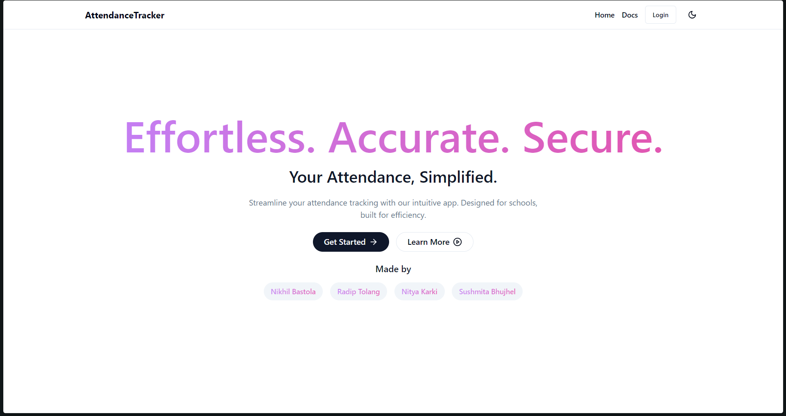
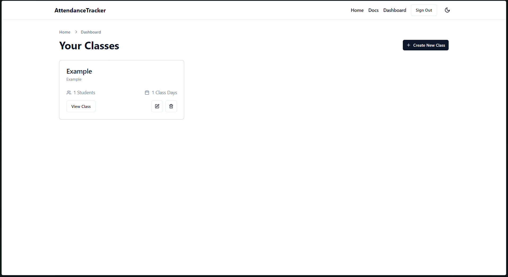
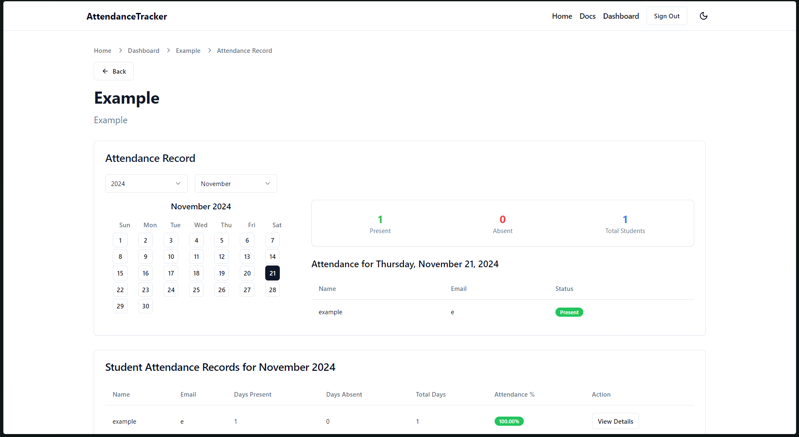
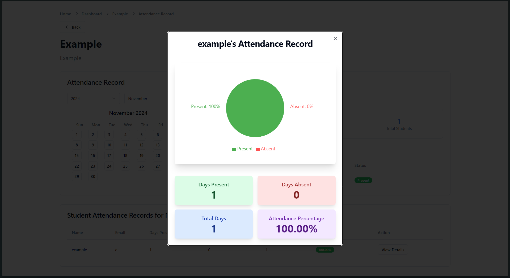

# Attendance Management System

## 🚀 About

This project is an Attendance Management System built with Next.js. It aims to streamline the process of tracking and managing student attendance in educational institutions.

## ✨ Features

- 🖲️ Easy Attendance Tracking
- 🧑‍🤝‍🧑 Student Management
- 📅 Calendar Integration
- 📃 Detailed Reports
- ⚡ Fast performance with Next.js

## 📃 Technologies Used

- Next.js
- Tailwind CSS
- Supabase
- Shadcn/ui
- Radix UI
- Lucide Icons
- Recharts
- Date-fns
- Framer Motion

<!-- ## 🛠️ Installation

1. Clone the repository:
   ```bash
   git clone https://github.com/zmercury/attendance.git
   ```
2. Navigate to the project directory:
   ```bash
   cd attendance
   ```
3. Install dependencies:
   ```bash
   npm install
   ```

## 🚦 Usage

To run the project locally:

1. Start the development server:
   ```bash
   npm run dev
   ```
2. Open your browser and navigate to `http://localhost:port`.
 -->

### Example Screenshots





